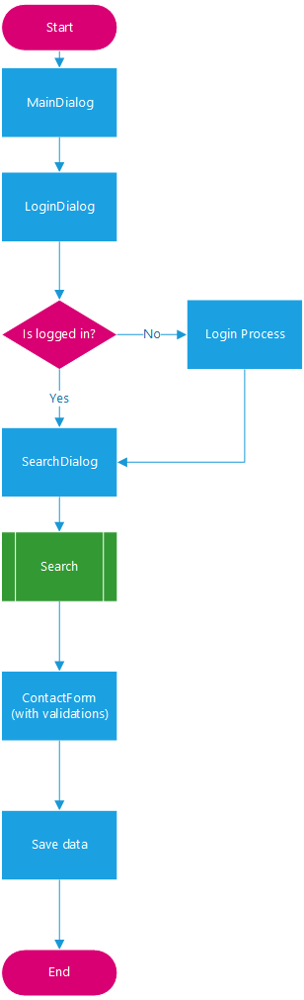
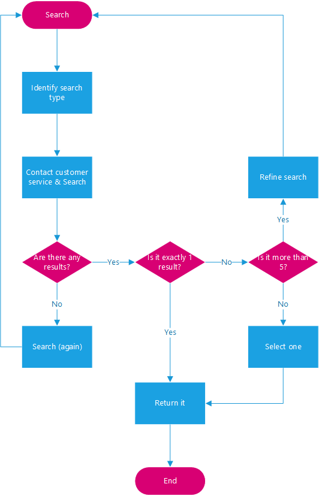

# SellerNotesBot

*Czech version below.*

This repository contains a working example of a chatbot which could serve as an digital assistant for a travelling sales representative. In this scenario we use the [Microsoft Bot Framework](https://dev.botframework.com/) to build a bot which allows to quickly note brief information about a meeting before travelling to the next one. This bot is able to run on Skype, Facebook Messenger or any other channel supported by the framework.

The bot's code shows:

* How to structure a streamlined conversation flow with **intelligent forms**.
* How to handle **dynamic date input** ("12. 3. 2016", "today", "tomorrow"...).
* How to **call external service** and use information during the conversation.
* How to **save information** to an external system (such as CRM).

## How to make it run

* Clone this repository
  * `git clone https://github.com/msimecek/SellerNotesBot.git`
* Open *SellerNotesBot.sln* in Visual Studio.
* Build it and restore NuGet packages.
  * **Do not** update NuGet packages (especially *System.IdentityModel.Tokens.Jwt* has to stay on version lesser than 5 - such as `4.0.2.206221351`).
* Press F5 and run the app. A browser window pointing to `http://localhost:3979` will open.
* Run the [Bot Framework Emulator](https://docs.botframework.com/en-us/tools/bot-framework-emulator/) and point it to http://localhost:3979/api/messages
* Start the conversation

## Conversation flow

Every conversation is a **chain of dialogs** with routes to child dialogs containing their own logic.



It this case, we're using `Chain.From`, `ContinueWith` and `While` to go through the process.

```c#
private IDialog<bool> CreateChain()
{
    // 1. kontrola přihlášení -> login dialog
    // 2. vyhledání kontaktu -> search dialog
    // 3. vyplnění formuláře -> contact form
    // 4. kontrola formuláře
    // 5. uložení

    return Chain.From(() => new LoginDialog())
        .ContinueWith<bool, Customer>(async (ctx, loginResult) =>
        {
            return await Task.FromResult(new SearchDialog());
        })
        .While(partner => new SearchTestDialog(partner), partner => new SearchDialog())
        .ContinueWith<Customer, ContactForm>(async (ctx, partner) =>
        {
            selectedCustomer = await partner;
            await ctx.PostAsync($"Pracujete s partnerem:\n - {selectedCustomer.Name}\n - DIČ: {selectedCustomer.VAT}\n - Kód: {selectedCustomer.Code}");

            var formDialog = ContactForm.BuildFormDialog();
            return formDialog;
        })
        .ContinueWith<ContactForm, bool>(async (ctx, form) =>
        {
            try
            {
                filledForm = await form;
            }
            catch (FormCanceledException<ContactForm> ex)
            {
                return Chain.Return(false); // uživatel zrušil form - uložit aktuální stav a smysluplně navázat
            }

            return Chain.Return(true); // krok schválení uživatelem
        });
}
```

### Login

Login and authentication itself is mocked in this case. Real authorization happens on the server side, which in reality can be different for every application.

Bot asks the user to open a sign-in web page and enter a code after login. Backend then gets an OAuth token which can be used to authenticate requests to the service.

To keep things simple, this bot just used a hardcoded username and password.

```c#
private async Task AfterLoginCodeEntered(IDialogContext context, IAwaitable<string> result)
{
    var code = await result;

    var loginService = new LoginService();
    var loginResult = await loginService.LoginAsync("a", "a");

    context.UserData.SetValue("UserToken", loginResult.id_token);

    await context.PostAsync("Díky, vše je v pořádku a můžete pokračovat.");
    context.Done(true);
}
```

Access token is saved to user session data which means that the sign-in process needs to be accomplished only for the first time.

### Customer search

`Chain.While` is useful in this scenario, because we want to repeat the search until we get a valid entity to use further.

```c#
.While(partner => new SearchTestDialog(partner), partner => new SearchDialog())
```

Search contains additional logic. This is the flow:



Search dialog is calling an external service to fetch records.

### Filling the form

Meeting information is a typical example of a **FormFlow form**. It's represented by a class with properties decorated with attributes which determine how will the bot serve individual prompts.

To store the date, we're intentionally using  `string`, because we want to allow the user to enter days in human format ("tomorrow" etc.)..

```c#
[Prompt("Který den proběhla schůzka? Zadejte den v týdnu nebo konkrétní datum:")]
[Describe("Datum")]
public string Date { get; set; }
```

The form itself is smart and determines whether to even ask for the day, or not.

```c#
.Field(nameof(Date),
    active: (formState) => {
        if (formState.MeetingToday)
        {
            var utcNow = DateTime.UtcNow;
            formState.Date = utcNow.ToString();
            formState.UtcDateTicks = utcNow.Ticks;
            return false; // don't ask for the date
        }

        return true;
    },
```

The bot first asks whether the meeting happened today. If so, it automatically fills in the date and will not ask for it.

```c#
validate: async (formState, value) => {
    ValidateResult result = new ValidateResult();

    DateTime parsedDate;
    bool parsingResult = DateTime.TryParse(value.ToString(), out parsedDate);
    if (parsingResult)
    {
        result.IsValid = true;
        result.Value = parsedDate.ToString();
        formState.UtcDateTicks = parsedDate.ToUniversalTime().Ticks;
    }
    else
    {
        var keywordResult = Utils.CzechDayToDate(value.ToString());
        if (keywordResult != null)
        {
            result.IsValid = true;
            result.Feedback = "Používám datum " + keywordResult.Value.ToShortDateString();
            result.Value = keywordResult.ToString();
            formState.UtcDateTicks = keywordResult.Value.ToUniversalTime().Ticks;
        }
        else
        {
            result.IsValid = false;
            result.Feedback = "Formát data není správný. Zadejte přímo datum (např. 3. 11. 2016) nebo den v týdnu (např. pondělí) nebo dnes/včera.";
        }
    }

    return await Task.FromResult(result);
})
```

### Form enums

One important thing in forms to remember is to start counting your enums from 1, not default 0. Because the form then doesn't render all buttons.

```c#
public enum CommChannel
{
   [Describe("Osobně")]
   [Terms("osobne", "osobně", "o")]
   InPerson = 1,
   
   [Describe("Telefonicky")]
   [Terms("telefonicky", "tel", "t")]
   Phone,
   
   [Describe("E-mailem")]
   [Terms("e-mailem", "email", "e")]
   Email
}
```

### Saving to backend

Thanks to the fact that a bot is just a WebAPI, it is able to call other web services, as long as it can reach them. In this project we only simulate it using the [ContactService](https://github.com/msimecek/SellerNotesBot/blob/master/SellerNotesBot/Services/ContactService.cs) class.


---

Chatovací bot může sloužit i ke sběru poznámek. V tomto repozitáři najdete základní kostru bota, který využívá [Microsoft Bot Framework](https://dev.botframework.com), a může běžet na některém z kanálů, které framework podporuje (Skype, Slack, Facebook Messenger atd.).

Scénář je následující:

1. Uživatel (obchodní zástupce, marketér, kdokoliv...) opouští schůzku se zákazníkem a chce si z ní rychle udělat poznámky, které se automaticky uloží do CRM systému.
2. Nasedne do auta a přes mobilní telefon napíše chatovacímu botovi.
3. Bot zjistí, o jakého zákazníka se jednalo, a stáhne ze systému detaily.
4. Bot se vyptá na další informace kolem schůzky (datum, jestli byla osobní, nebo telefonická).
5. Bot se zeptá na poznámku ve formě prostého textu.
6. Všechny informace o setkání se uloží do CRM.

Z technologického pohledu tento kód ukazuje především řešení:

* Autentizace uživatele k CRM systému.
* Volání externího systému pro vyhledávání kontaktů (zákazníků).
* Směrování dialogu podle toho, jaké informace právě potřebujeme získat.
* Inteligentní formuláře, které nenutí konkrétní formát data.
* Ukládání informací do externího systému (např. CRM).

## Jak bota zprovoznit

* Stáhněte si klon tohoto repozitáře
  * `git clone https://github.com/msimecek/SellerNotesBot.git`


* Otevřete *SellerNotesBot.sln* ve Visual Studiu
* Spustťe Build (jehož součástí je obnova NuGet balíčků)
  * **Ne**aktualizujte NuGetové balíčky (obzvlášť *System.IdentityModel.Tokens.Jwt* musí zůstat na verzi `4.0.2.206221351`).
* Pomocí F5 spusťte aplikaci, otevře se okno prohlížeče mířící na `http://localhost:3979` 
* Spusťte [Bot Framework Emulator](https://docs.botframework.com/en-us/tools/bot-framework-emulator/) a nasměrujte ho na http://localhost:3979/api/messages
* Vyzkoušejte konverzaci

## Klíčové body konverzace

### Přihlášení

Autentizace je v tomto případě pouze naznačena - chybí bod samotného přihlášení, který se ale děje na serverové straně. Bot vyzve uživatele, aby kliknutím na odkaz otevřel přihlašovací webovou stránku a následně opsal kód, který mu poskytla. Tím backend získá OAuth token, který dokáže spárovat s uživatelem bota.

Pro jednoduchost se v tomto projektu zadává rovnou fiktivní login a heslo:

```c#
private async Task AfterLoginCodeEntered(IDialogContext context, IAwaitable<string> result)
{
    var code = await result;

    var loginService = new LoginService();
    var loginResult = await loginService.LoginAsync("a", "a");

    context.UserData.SetValue("UserToken", loginResult.id_token);

    await context.PostAsync("Díky, vše je v pořádku a můžete pokračovat.");
    context.Done(true);
}
```

Token se ukládá do dat uživatele a přihlášení tedy stačí udělat při první interakci.

### Průběh konverzace

Celá konverzace je zabalena do hlavního Chainu:

```c#
private IDialog<bool> CreateChain()
{
    // 1. kontrola přihlášení -> login dialog
    // 2. vyhledání kontaktu -> search dialog
    // 3. vyplnění formuláře -> contact form
    // 4. kontrola formuláře
    // 5. uložení

    return Chain.From(() => new LoginDialog())
        .ContinueWith<bool, Customer>(async (ctx, loginResult) =>
        {
            return await Task.FromResult(new SearchDialog());
        })
        .While(partner => new SearchTestDialog(partner), partner => new SearchDialog())
        .ContinueWith<Customer, ContactForm>(async (ctx, partner) =>
        {
            selectedCustomer = await partner;
            await ctx.PostAsync($"Pracujete s partnerem:\n - {selectedCustomer.Name}\n - DIČ: {selectedCustomer.VAT}\n - Kód: {selectedCustomer.Code}");

            var formDialog = ContactForm.BuildFormDialog();
            return formDialog;
        })
        .ContinueWith<ContactForm, bool>(async (ctx, form) =>
        {
            try
            {
                filledForm = await form;
            }
            catch (FormCanceledException<ContactForm> ex)
            {
                return Chain.Return(false); // uživatel zrušil form - uložit aktuální stav a smysluplně navázat
            }

            return Chain.Return(true); // krok schválení uživatelem
        });
}
```

### Hledání zákazníka

Hledání zákazníka používá While, který zajistí, že se bude dialog opakovat do té doby, dokud nenajdeme entitu, s kterou budeme dál pracovat.

```c#
.While(partner => new SearchTestDialog(partner), partner => new SearchDialog())
```

Chain se stará o to, aby po sobě jednotlivé kroky správně následovaly a předávaly si výstupy.

### Vyplňování formuláře

Informace o schůzce jsou klasickým formulářem FormFlow.

Datum ukládáme schválně jako `string`, abychom nenutili uživateli konkrétní formát.

```c#
[Prompt("Který den proběhla schůzka? Zadejte den v týdnu nebo konkrétní datum:")]
[Describe("Datum")]
public string Date { get; set; }
```

Formulář pak chytře rozhodne, zda se na něj vůbec zeptá a jak vyhodnotí odpověď.

```c#
.Field(nameof(Date),
    active: (formState) => {
        if (formState.MeetingToday)
        {
            var utcNow = DateTime.UtcNow;
            formState.Date = utcNow.ToString();
            formState.UtcDateTicks = utcNow.Ticks;
            return false; // nechceme zobrazit otázku na datum
        }

        return true;
    },
```

Bot nejprve zjistí, jestli schůzka proběhla dnes. Pokud ano, doplní automaticky datum a nebude se na něj ptát.

```c#
validate: async (formState, value) => {
    ValidateResult result = new ValidateResult();

    DateTime parsedDate;
    bool parsingResult = DateTime.TryParse(value.ToString(), out parsedDate);
    if (parsingResult)
    {
        result.IsValid = true;
        result.Value = parsedDate.ToString();
        formState.UtcDateTicks = parsedDate.ToUniversalTime().Ticks;
    }
    else
    {
        var keywordResult = Utils.CzechDayToDate(value.ToString());
        if (keywordResult != null)
        {
            result.IsValid = true;
            result.Feedback = "Používám datum " + keywordResult.Value.ToShortDateString();
            result.Value = keywordResult.ToString();
            formState.UtcDateTicks = keywordResult.Value.ToUniversalTime().Ticks;
        }
        else
        {
            result.IsValid = false;
            result.Feedback = "Formát data není správný. Zadejte přímo datum (např. 3. 11. 2016) nebo den v týdnu (např. pondělí) nebo dnes/včera.";
        }
    }

    return await Task.FromResult(result);
})
```

Validační část je komplexnější, protože umožňujeme zadat datum i "lidsky" - tedy dnes, zítra apod.
